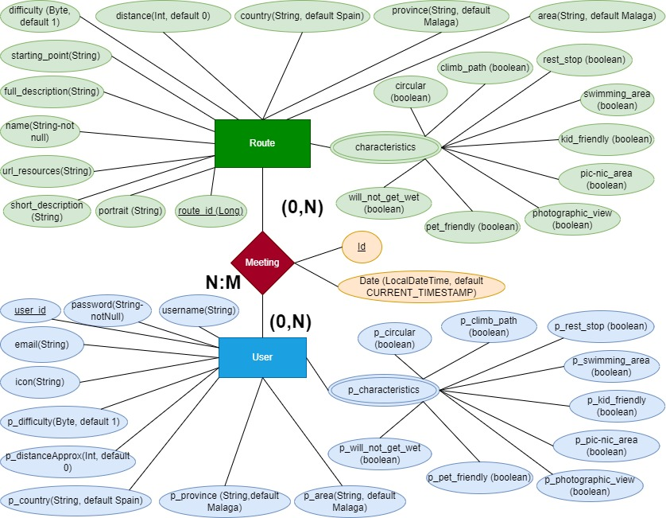

# ES
## Proyecto Match
ODS relacionados: Salud y bienestar (3) y Vida y ecosistemas terrestres (15)
## Objetivo :
Implementar una web facilitando prácticas encaminadas a garantizar el uso sostenible de los recursos naturales y fomentando practicas de vida saludable.
Tangencialmente, se consigue además una labor social, en cuanto a que conecta personas con intereses y gustos comunes.

## Método :
Creación de una pagina web en la que, facilitando el usuario unos datos en un cuestionario, la propia web le conecte con las rutas mas adecuadas a sus gustos, limitaciones, características, cruzando la información contenida en la base de datos.

## Flujogramas

___
# EN
## Match Project
Related SDGs: Health and well-being (3) and Terrestrial Life and Ecosystems (15)
## Objective :
To implement a website facilitating practices aimed at ensuring the sustainable use of natural resources and promoting healthy living practices.
Tangentially, it also achieves social work, in that it connects people with common interests and tastes.

## Method :
Creation of a web page in which, by providing the user with some data in a questionnaire, the web itself connects them with the most suitable routes according to their tastes, limitations, characteristics, crossing the information contained in the database.
## Views Flows diagram

## Database Entity Relation diagram
### V1

