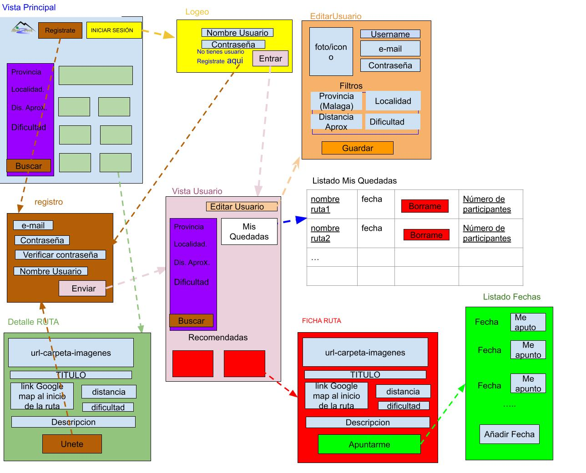

# EN

## Objective :
A website that facilitate practices aimed at ensuring the sustainable use of natural resources and promoting healthy living practices.
Tangentially, it also achieves social work, in that it connects people with common interests and tastes.

## Method :
Creation of a web page using (MySQL+ SpringBoot + SpringData +SpringWeb + REACT) in which, by providing the user with some data in a questionnaire, the web itself connects them with the most suitable routes according to their tastes, limitations, characteristics, crossing the information contained in the database.


And it allows you to create meetups, which can be joined by other users, as well as join meetups created by other users.


## V1
You can see the available Http requests at our [API_V1 documentation](documentation_en/API_V1.md).
### Views Flows diagram

### Database Entity Relation diagram

## Run
1. Create a database named 'meet2treek' in MySQL with access credentials 'root/root', or use any credentials you prefer if you adapt the file: "/../meet2trek/spring_boot/src/main/resources/application.properties".
2. Open the folder:  "/.../meet2trek/spring_boot" using "IntelliJIDEA" with "Java 21".
3. Right-click on the file:
- "/.../meet2trek/spring_boot"
- Scroll down to: "Maven"-->"Download Sources".
4. Right-click on the file:
 - "/.../meet2trek/spring_boot"
- Scroll down to: "Maven"-->"Reload Project".
5. Open:
- "/../meet2trek/spring_boot/src/main/java/com/esplai/meet2trek/Meet2trekApplication.java" 
- and run it. 
- If the connection to the database works, the tables: 'meeting', 'route', 'user', 'user_saved_routes', and 'users_in_meeting' will be created. The API will be running at:  "http://localhost:8080".

6. To run the graphical interface (I use Visual Studio Code), open the directory: "/.../meet2trek/meet2trek-react", in the console.
7. Run:
- If Node+Vite is not installed: 
https://nodejs.org/en/download/prebuilt-installer
```bash
install all requiered

#npm créate vite@latest
   Y 
   React
   Javascript-swc
```
- If Node+Vite is already installed: 

```bash
npm install
npm run dev
```
8. Open in your browser: "http://localhost:5173/".

# ES

## Objetivo :
Implementar una web facilitando prácticas encaminadas a garantizar el uso sostenible de los recursos naturales y fomentando practicas de vida saludable.
Tangencialmente, se consigue además una labor social, en cuanto a que conecta personas con intereses y gustos comunes.

## Método :
Creación de un projecto en el que, facilitando el usuario unos datos, la propia web le conecte con las rutas mas adecuadas a sus gustos, limitaciones, características, cruzando la información contenida en la base de datos y le facilita el establecer comunicacion con otros usuarios con gustos similares. Además de permitirle dar de alta sus propias rutas y propuestas de quedadas.

## Descripcion del API
Permite :registro, eliminación y modificacion de Usuarios;  creación, eliminación , modificacion y busqueda de rutas ; creación, eliminación y modificacion de quedadas, para ello se desarrolla en SpringBootData + Hibernate un API RESTFULL[ pinche aqui para ver la documentación del API](documentacion_es/API_Prototipo.md).
### Vistas




### Diagrama entidad relación


## Run
1. Crear una base de datos llamada 'meet2treek' en mysql con credenciales de acceso 'root/root', o las que se deseen si luego cambias el fichero :"/../meet2trek/spring_boot/src/main/resources/application.properties"
2. Abrir la carpeta: "/.../meet2trek/spring_boot" con IntelliJIDEA.
3. Boton derecho sobre el fichero :
- "/.../meet2trek/spring_boot"
- busca:"Maven"-->"Download Sources".
4. Boton derecho sobre el fichero:
 - "/.../meet2trek/spring_boot"
- busca:"Maven"-->"Reload Project".
5. Abrir: 
- "/../meet2trek/spring_boot/src/main/java/com/esplai/meet2trek/Meet2trekApplication.java" 
- y ejecutar.
 Si la conexion a la base de datos funciona, se crearan las tablas: 'meeting', 'route', 'user','user_saved_routes' y 'users_in_meeting'. Y quedara la API ejecutandose en : "http://localhost:8080".

6. Para ejecutar la interfaz grafica abri con la cosola el directorio: "/.../meet2trek/meet2trek-react".
7. Ejecutar:
- Si no tiene instalado Node+Vite:
https://nodejs.org/en/download/prebuilt-installer
install all requiered
```bash
#npm créate vite@latest
   Y 
   React
   Javascript-swc
```
- Si ya tines instalado Node+Vite:   
```bash
npm install
npm run dev
```
8. Abrir en tu navegador: "http://localhost:5173/".


